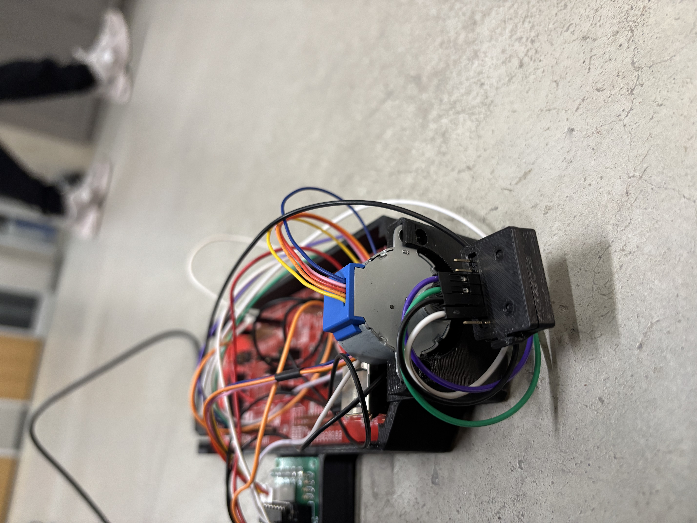

# Cost-Effective Embedded LIDAR Scanner

A cost-effective, hardware-integrated LIDAR scanner built using embedded firmware programming and time-of-flight telemetry to map, process, and render 3D models of physical spaces.

## Project Overview
This project delivers a budget-friendly alternative to expensive industrial LIDAR configurations. Utilizing a microcontroller and a Time-of-Flight (ToF) ranging sensor, the system accurately samples environmental distance data. The captured spatial point clouds are transmitted over a serial interface to MATLAB, where they are dynamically visualised and assembled into complete 3D models of open spaces like hallways.

### System Architecture & Technologies
- **Firmware & Drivers:** Custom Embedded C drivers mapping register-level operations on the microcontroller.
- **Microcontroller Platform:** Texas Instruments ARM Cortex-M architecture (TM4C1294NCPDT / MSP series).
- **Sensors & Protocols:** STMicroelectronics VL53L1X Time-of-Flight sensor operating over an I2C communication bus.
- **Peripherals & Timing:** Hardware abstraction layers managing SysTick timers, PLL clock configurations, and onboard LEDs.
- **Data Streaming:** High-speed UART serial communication transferring telemetry data to a host machine.
- **3D Visualization:** Custom MATLAB computational scripts reading serial streams to generate point clouds and 3D surface meshes.

## Repository Structure
- 2dx_studio_8c.c: Core application firmware orchestrating the state machine and data acquisition loops.
- vl53l1_platform.c & VL53L1X_api.c: Platform-specific I2C read/write logic and API bindings for the distance sensor.
- microprocessorsMATLAB.m: Data acquisition and 3D point-cloud rendering script.
- uart.c / SysTick.c / PLL.c: Low-level peripheral driver initializations.

## Hardware Setup
To reproduce this system, connect your hardware components using the following bus configuration:
1. **I2C Bus:** Wire the VL53L1X ToF sensor's SDA and SCL pins to the designated I2C peripheral pins on the microcontroller (ensure proper pull-up resistors are applied).
2. **Power:** Provide a stable 3.3V VCC and a common Ground (GND) across the microcontroller and sensor boards.
3. **Serial Interface:** Connect the microcontroller to your host PC over USB to bridge the UART serial line.

## How to Run & Visualize

### 1. Flash the Firmware
1. Open the Keil uVision project (2dx_studio_8c.uvprojx) on your host machine.
2. Build the project targets to ensure error-free compilation.
3. Connect your microcontroller and flash the compiled binary to the board.

### 2. Execute the 3D Render
1. Ensure your microcontroller is powered on, initialized, and connected to your computer's COM port.
2. Open MATLAB and load the microprocessorsMATLAB.m script.
3. Update the script's serial configuration line with your active system COM port and baud rate.
4. Run the script and clear the sensor's physical pathway to observe the real-time 3D hallway visualization.
